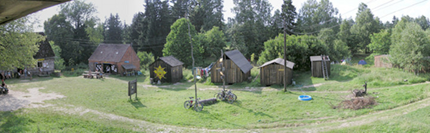
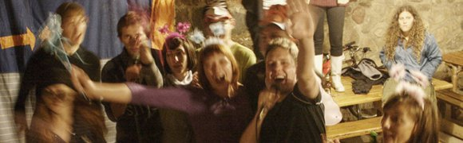

## Letnia Szkoła Go 2016 XVII Memoriał im. Jerzego Sacharewicza 

**MIEJSCE**: [Przystanek Alaska](http://www.alaska.sundar.pl/) -- Gliśno -- Bory Tucholskie  
**TERMIN**: 11--24 Lipca 2016 

Sponsorami LSG 2016 są: 

Czas mija a my spotykamy się już 17. raz. Od wielu lat LSG jest organizowana na terenie gospodarstwa agroturystycznego "Przystanek Alaska" położonego nad jeziorem -- niesłychanie malowniczego, przepięknego i spokojnego regionu Borów Tucholskich. 

Na wyposażeniu gospodarstwa znajdują się:

- pole namiotowe -- trzy polany (wzgórze, las przy drodze nad jezioro, polana za domkami) 
- **kuchnia turystyczna** (piec opalany drewnem) -- powszechnie dostępna. Woda, prąd, czajnik, lodówka, garnki i talerze, miejsce do przygotowania posiłku. 
- **sklepik o standardowych cenach** bez horrendalnych narzutów 
- **czyste toalety**, prysznic z kotłami, gdzie trzeba podgrzać wodę, sauna 
- płatny prysznic z ciepłą wodą dostępny w godzinach rannych i wieczornych 
- ogromna **stodoła przerobiona na salę do tanców, zajęć, gier** i innych (na 100 osób), 
- domki z łóżkami polowymi do noclegu, 
- wiele atrakcji (miedzy innymi: **stadnina** (możliwość jazdy konnej -- polecana wcześniejsza rezerwacja), jezioro (1 klasa czystości z prywatną plażą), kajaki, tv, dvd, komputer do odtwarzania muzyki, pole golfowe, **siatkówka**, koszykówka, ściana wspinaczkowa, strzelnica, szlaki wycieczkowe, kamienne kręgi) 

Klimat tego miejsca jest stylizowany na serial "Przystanek Alaska" -- a polityka właścicieli to zapewnienie wysokiej klasy obsługi z elementami survivalu i relaksu. 

Bliższe informacje można znaleźć na [stronie Alaski](http://www.alaska.sundar.pl/), gdzie jest dużo zdjęć i dodatkowych informacji.  
Jest to naprawdę niezwykłe miejsce i polecam je każdemu.
