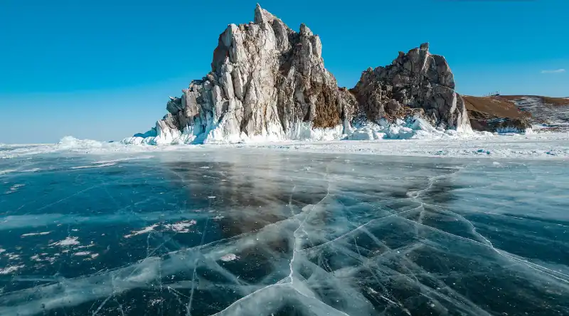
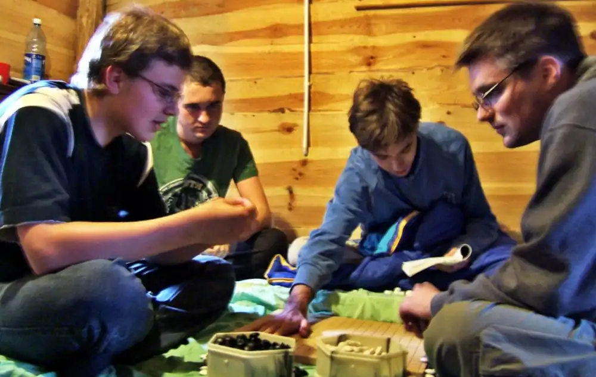
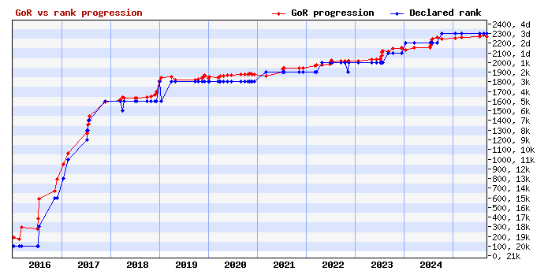
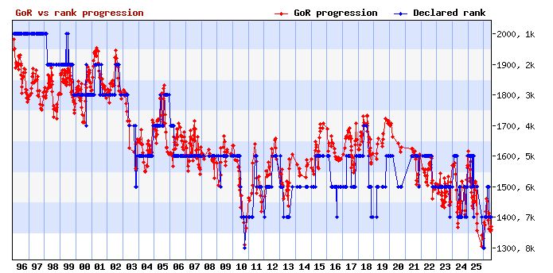
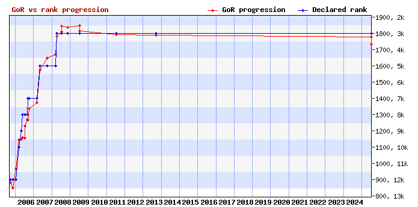

# Quiz taskiego 🤯

- Utworzcie grupy po 3-5 osób
  - może być mniej lub więcej jeśli bardzo chcecie
- Będziecie potrzebowali:
  - kartkę 🗒️
  - pisak 🖊️
  - mósk 🧠
- Nie można korzystać z internetów i LLMów
  - ... i inaczej oszukiwać
  - używajcie swoich głów!
- Można podpuszczać przeciwników
- Poprawna odpowiedź 1 punkt
  - chyba że napisane/powiedziane inaczej

---
Jezioro Kamieniczno ma powierzchnie 120 hektarów (1.2 km^2) i zawiera koło 11 milionów kubików wody 🌊

### 1. Ile razy więcej wody zawiera jezioro Bajkał?

.answer[.label[A] 2 000]
.answer[.label[B] 20 000]
.answer[.label[C] 200 000]
.answer[.label[D] 2 000 000]



---
# 2. Którego roku odbyło się pierwsze LSG na Alasce?


☝️ obrazek z innego niż pierwszego LSG

---
# 3. Kim są ci ludzie?

(imiona/ksywy!)



---
# Pojedynek pamięciowy

- Zobaczycie goban na 15 sekund 👀 ⏳
- Zapamiętacie 🧠
- Zobaczycie pytanie ❓
- Zapiszecie odpowiedź 📝

---
<div data-wgo-sgf="eleven.sgf"></div>

---
# 4.

## Jakie rozmiary

## miał

## &nbsp; &nbsp; &nbsp; &nbsp; &nbsp; &nbsp; &nbsp; ten goban? 🟨

---
<div data-wgo-sgf="illegal.sgf"></div>

---
# 5.

## Czy były na gobanie

## jakieś

## &nbsp; &nbsp; &nbsp; &nbsp; &nbsp; &nbsp; &nbsp; kamyczki bez oddechów? 💀

---
<div data-wgo-sgf="handi.sgf"></div>

---
# 6.

## Ile miał

## czarny

## &nbsp; &nbsp; &nbsp; &nbsp; &nbsp; &nbsp; &nbsp; handicapów? ⚫

---
# Przerwa ⏳

Proszę zapisać wszystkie odpowiedzi 📝

💀💀 Na następującym slajdzie są rozwiązania! 💀💀

### ...gotowi? ⌚

---
## Odpowiedzi:

1. D – 2 000 000: Bajkał zawiera 23 000 km^3 wody (Kamieniczno 0.01 km^3)
2. Pierwsze LSG na Alasce odbyło się roku 2005
3. Czarek (Cezary, Nickless), Kobuz (Marcin so cool), Murugandi (Muru, Kim Ouweleen), Ignus (M. A. Łukasiewicz) ... *ćwierć pkt za każdego*

<div style="float: left; width: 220px; text-align: center;">4. 11×11</div>
<div style="float: left; width: 220px; text-align: center;">5. nie, nie były</div>
<div style="float: left; width: 220px; text-align: center;">6. trzy handi</div>
<div style="clear: both"></div>
<div style="float: left; width: 220px; height: 200px;" data-wgo-sgf="eleven.sgf"></div>
<div style="float: left; width: 220px; height: 200px;" data-wgo-sgf="illegal.sgf"></div>
<div style="float: left; width: 220px; height: 200px;" data-wgo-sgf="handi.sgf" data-wgo-autoplay="5"></div>

---
Druga połowa...

### 7. Od 2005 do 2025 roku rozegrano na Alasce 77 turniejów. Napiszcie listę dziesięciu graczy którzy przez te 21 lat rozegrali najwięcej gier.

(łącznie aż 5 pkt!)

~

### 8. Ile gier rozegrał ten który zagrał najwięcej?

---
### 9. Czyj to graf rankingowy?



---
### 10. A taki, eh?



---
### 11. Kto wrócił do gry?



---
### Przysłowia goistyczne

# 12. 🏠🔥❌🚶‍➡️🎣

# 13. 🤷➡️🚶‍➡️

# 14. 🛸👽📍2️⃣1️⃣

# 15. 👁️🏆🫯

# 16. 1️⃣🏃‍➡️❌👎

---
### 17. Największy turniej na Przystanku Alaska

- Ile w nim grało graczy? (plus minus 10) *(pół pkt)*
- W którym był roku? *(ćwierć pkt)*
- Kto go wygrał? *(ćwierć pkt)*

---
# Przerwa przed końcem ⏳

Proszę zapisać wszystkie odpowiedzi 📝

💀💀 Na następującym slajdzie są rozwiązania! 💀💀

### ...gotowi? ⌚

---
### 7. pół punktu za każdego gracza z listy, niezależnie od kolejności

```
Most games played
-----------------
 1. Fraczak Pawel (14650768)         251
 2. Majka Marcin (14713413)          231
 3. Frejlak Jan (12801591)           192
 4. Blumberg Klaus (10486124)        191
 5. Walaszewski Maksym (15050673)    184
 6. Frejlak Stanislaw (12837594)     179
 7. Palej Malgorzata (13925032)      160
 8. Cieslak Karol (14649228)         159
 9. Beltowska Katarzyna (13013968)   147
10. Kwietniewska Daria (16062684)    143
```

### 8. Alvar 251 gier!

- 240-260: 1 pkt
- 230-270: pół pkt
- 200-300: ćwierć pkt

---
class: compact-answers

.answer[**9. Antek Bugaj** ]
.answer[**10. Krzysztof Podbiol** ]
.answer[**11. Marcin Tomczyk <br/> — &ldquo;EmTom&rdquo; ** ]

---
### 12. 🏠🔥❌🚶‍➡️🎣
### "Don't go fishing when your house is on fire"

### 13. 🤷➡️🚶‍➡️ "When in doubt, tenuki"

### 14. 🛸👽📍2️⃣1️⃣
### "Strange things happen at 2-1 point"

### 15. 👁️🏆🫯 "Eyes win semeais"

### 16. 1️⃣🏃‍➡️❌👎 "One point jump is never bad"

Małe wariacje co do powyższych są ok, jak nie wiadomo to pytajcie!

---

### 17.

```
; EV[J. Sacharewicz Memorial]
; DT[2006-07-12,2006-07-13]
  1 Brunner Vit        4d CZ Brn   22 5  13+  5+  6+  3+  2+  0=
  2 Zyzak Andrzej      1d PL Wodz  21 4   4+  3- 10+  8+  1-  7+
  3 Jachym Radoslaw    2d PL Tych  21 4  11+  2+ 14+  1-  6+  4-
  4 Wieczorek Wojciech 3d PL Zory  21 4   2- 17+  5+  6- 11+  3+
  5 Chwedyna Kamil     2d PL Kedz  21 4  15+  1-  4- 16+ 12+  6+
  6 Bozek Krzysztof    2d PL Kato  20 3   7+  9+  1-  4+  3-  5-
  7 Mex Gerd           2d DE GOE   20 3   6- 14- 21+  9+  8+  2-
```

- 86 graczy *(jak macie 76-96: pół pkt)*
- rok 2006 *(ćwierć pkt)*
- ja wygrał! *(ćwierć pkt)*

Mając pewne pierwsze miejsce 🏆  
Bezczelnie się zdropował z ostatniej rundy 🇨🇿

---

# 1️⃣2️⃣3️⃣➡️ 🫎🏆🚀

# Dzięki! 🙏
